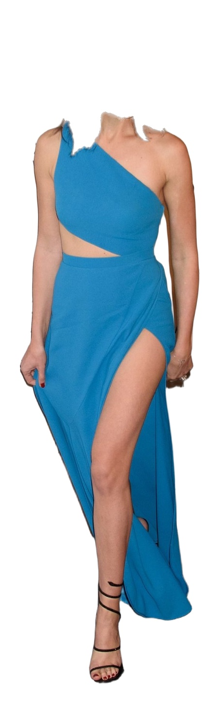
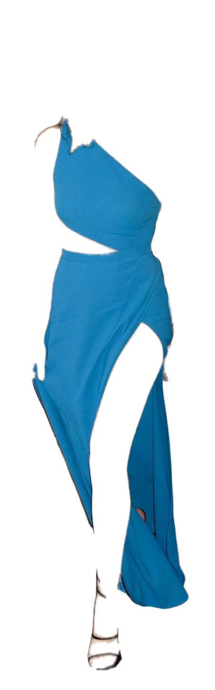
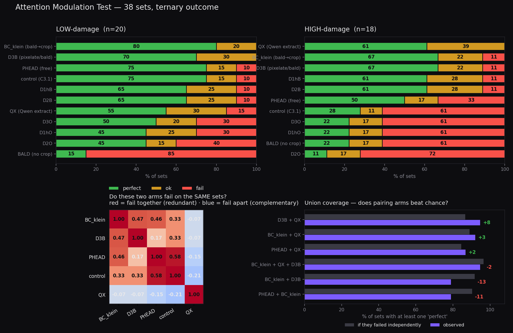
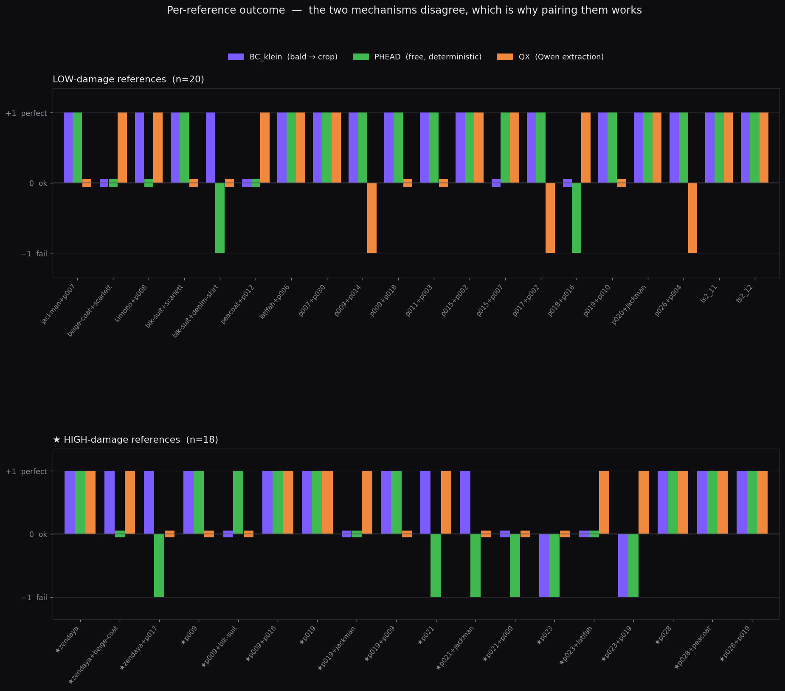

# v2.2 Results

## v2.2.1 — garment reference cropping

**Status: cropper built, klein trials run, human review complete.**
Interactive screen: [`v2/artifacts/v221_crop_screen.html`](../../../v2/artifacts/v221_crop_screen.html)
(13 references, 117 images). Tool: `v2/build/garment_crop.py`. All work local, CPU,
zero spend.

### Crop variants (naming: C for crop)

| | Variant | What it contains |
|---|---|---|
| **C1** | `bbox` | Whole-subject crop, background untouched |
| **C2** | `bbox_nobg` | Same crop, background white, the wearer kept |
| **C3.1** | `no_face` | Background white, **hair AND face removed**; body skin kept |
| **C3.2** | `no_face_keep_hair` | Background white, **face only removed — hair is kept**, including hair lying over the clothing |
| **C4** | `clothes_only` | Every clothing class (coat, trousers, shoes, accessories); skin and face removed |

The C3 split is the whole point of having two variants: `head = HAIR + FACE` for
C3.1 versus `face_only = FACE` for C3.2 (`garment_crop.py:387-399`). C3.1 pays for
a clean identity cut by deleting whatever garment the hair was covering; C3.2 keeps
the garment intact and leaves hair on it. **How much C3.1 pays is measured below.**

C3 and C4 also carry an RGBA PNG with true alpha and an SVG mask contour as
inspection artifacts. Model-facing images are explicitly white-flattened RGB —
never rely on an endpoint to flatten alpha, since a default black flatten would
be far worse than white.

### The original cropping solution, and why it was replaced

The first implementation used **MediaPipe Selfie Multiclass (256×256)** as the sole
segmenter: threshold its probability map to a binary mask, upsample ~6× to the
reference resolution, refine with a guided filter, and cut. It worked
semantically — all 13 references produced usable crops, clothes-class confidence
0.82–0.90 — but every boundary was a visible staircase.

The cause was structural, not a tuning problem: **a binary label upsampled 6×
cannot produce a smooth edge.** Measured across all 13 references, the fraction of
pixels with genuinely fractional alpha was **exactly 0.00%** — the old boundary
was a hard label by construction.

One earlier approach was tried and discarded before that: a **YCrCb/HSV
skin-colour heuristic** to separate clothes from skin. It failed exactly where
predicted — a wedge was torn out of the beige coat on the dark-skinned model, and
the brown plaid overcoat was read as skin and destroyed. That is a bias failure,
not a threshold failure; no parameter value fixes it. It survives only as a
fallback route.

### The new solution

Three changes, the middle one load-bearing:

1. **BiRefNet_lite (224MB ONNX, MIT) supplies the subject alpha at 1024×1024.**
   MediaPipe multiclass is demoted to *semantic labels only*. BiRefNet decides
   what the subject is; multiclass decides which part is which.
2. **Composition is subtractive, not intersective.** `subject × clothes_class`
   notched 6px blocks out of the peacoat outline, because at the silhouette the
   clothes class is exactly as coarse as the 256×256 map it came from. Now
   **C3 = matte − head** and **C4 = C3 − body skin**: head and skin are interior
   and localised, so the high-resolution matte always owns the outline.
3. **Whole-body crop replaces the category band.** The shoulders-to-hips /
   hips-down prior is deleted. This dissolves the hem bug by construction — the
   navy peacoat previously dragged the jeans in as a band artifact; coat, jeans
   and boots now come through whole. Target-garment selection is the prompt's
   job, not the cropper's. A `select_region` knob is stubbed and defaulted off.

**A prescribed step was tested and dropped.** Trimap + guided-filter matting over
the BiRefNet output made results *worse* — white speckles punched ~15px into the
peacoat sleeve, because guided filtering transfers image structure into alpha and
dark fabric on a white ground is the worst case. The raw matte is already clean
soft alpha and is used as-is. Trimap refinement is confined to the internal
clothes-vs-skin boundary, which genuinely is a coarse label.

### Improvement

Metric: `jag` = mean |second difference| of the sub-pixel boundary column, plus
the fraction of genuinely fractional alpha. Same boundary, same source
coordinates, old pipeline vs new.

| Reference | jag old → new | soft alpha old → new |
|---|---|---|
| lp_beige_long_coat | 0.427 → **0.048** | 0% → 0.8% |
| hugh_jackman_grey_suit | 0.180 → **0.019** | 0% → 1.1% |
| gal_gadot_blue_dress | 0.219 → **0.025** | 0% → 1.1% |
| navy_peacoat | 0.157 → **0.025** | 0% → 0.8% |
| lp_plaid_overcoat | 0.247 → **0.031** | 0% → 0.7% |
| lp_floral_kimono | 0.253 → 0.255 | 0% → 0.9% |
| man_black_suit | 0.309 → 0.381 | 0% → 0.6% |
| 6 product references | all improved (e.g. 0.590 → 0.212) | 0% → 0.3–1.2% |

*Beige coat boundary at 4× zoom. Left: 256×256 map thresholded and upsampled —
jag 0.43, zero soft-alpha pixels. Right: BiRefNet 1024 matte used as-is —
jag 0.05, 0.82% soft alpha. Per-reference versions of this comparison are the
last item in each set on the screen page.*

**The two rising numbers are not regressions.** On the black suit and the kimono
the new boundary follows real geometry — a lapel fold, a hanging fabric tie —
that the old pipeline's 9–15px morphological smoothing rounded away. The metric
penalises true structure. Visual review confirms both are better: the old black
suit had a light halo and 6px steps along the lapel; the new one cuts tight. No
reference is worse than the old pipeline.

Residual defects, all unchanged or improved versus old: the body-skin class at
256×256 still leaves a sliver of neck and part of one hand on the Jackman
reference, and cuff slivers at the peacoat wrists.

### Hair-removal damage — what C3.1 costs, measured (2026-08-16)

Recorded because the reviewer identified this cohort by eye during phase 2 and it
was **not written down anywhere** — p021 and p028 appeared only in PLAN.md as the
rationale for having two C3 variants, p016 only as a small-subject case, and p009
in no document at all. This is the traceability record for it, and the test set for
restoration work.

Measured as `C3.2 − C3.1` — the region hair removal takes out of the garment,
as a share of the C3.2 garment area. Split by whether the removed region is
**enclosed** by garment or **open** to the background, since those need different
repairs. Roughness is perimeter²/4πA on the silhouette (1.0 = a circle).

| ref | garment lost | enclosed | open | roughness C3.2 → C3.1 |
|---|---|---|---|---|
| **p021** | **19.53%** | 0.00% | 19.52% | **3.0 → 6.2** — doubles |
| **p028** | **11.92%** | 0.00% | 11.91% | 1.9 → 1.9 |
| **p016** | **9.75%** | 1.51% | 7.99% | 8.6 → 7.2 |
| **p009** | **7.22%** | 0.00% | 7.20% | 3.8 → 2.4 |

**Two findings that change how this should be fixed.**

1. **The damage is open, not enclosed — 19.52 of 19.53 points on p021, and all of
   p009 and p028.** Only p016 has any enclosed component at all (1.51%). This
   matters because the two are not the same repair problem: an enclosed hole is
   surrounded by known fabric and inpainting is well-posed, whereas an open notch
   has garment on one side and background on the other, so filling it means
   **extending the silhouette outward** with nothing constraining where the garment
   should end. Framing this cohort as an inpainting problem would be a category
   error.
2. **Only p021 actually gets jagged.** Its roughness doubles (3.0 → 6.2). p028 is
   unchanged and p009 and p016 get *smoother*. So the cohort holds two distinct
   sub-cases: **ragged removal** (p021) versus **clean removal of a large area**
   (p009, p028, p016) — a garment that is simply missing a smooth chunk. Both are
   damage; only the first is the "jaggedness" named in the phase 2 review.

**The cohort is larger than the four identified by eye.** Ranking all 48
references by the same measure, seven more sit at comparable or higher levels:

| ref | garment lost to hair removal |
|---|---|
| p021 | 19.53% |
| **`dualuse_woman_top_denim_skirt_nonceleb`** | **16.97%** |
| p023 | 16.92% |
| `dualuse_zendaya_white_blazer_skirt` | 14.41% |
| p012 | 13.98% |
| p019 | 13.52% |
| p028 | 11.92% |
| p030 | 11.46% |
| `dualuse_scarlett_johansson_black_dress_backview_night` | 9.84% |
| p016 | 9.75% |
| p009 | 7.22% |

The second entry closes a loop: **`woman_top_denim_skirt` is the garment source of
the one set no crop arm solved**, whose reviewer note blamed hair jaggedness. It
loses 16.97% of the garment, all of it open. The eye-identified cohort and the
measurement agree on the mechanism; the eye simply under-counted how many
references carry it.

**Restoration test set:** the eleven references above, with p021 (worst, and the
only ragged one) and `woman_top_denim_skirt` (the known downstream failure) as the
two must-pass cases. Rationale and method in
[EXPERIMENT.md](EXPERIMENT.md) section 2c, component R.

| C3 `no_face` | C4 `clothes_only` |
|---|---|
|  |  |

### Runtime

| Stage | Cost |
|---|---|
| BiRefNet matte, first pass | 104–320 s per duo reference on CPU (4 cores, contended) — **cached** to `v2/runs/.cache/matte/` |
| Everything downstream, matte cached | 0.5–2.0 s per duo reference, 0.1–0.3 s per product reference |
| Full 13-reference re-run | ~8 s |

Parallelism was tested and **made it slower**: 3 worker processes drove free RAM
to ~16MB, onnxruntime's mmap began paging, and total CPU fell to ~35%. Default is
1 worker. Not a production concern — on GPU BiRefNet runs ~17 FPS at 1024², and
garment crops are cacheable per catalog image rather than recomputed per request.

### Decisions out of v2.2.1

- **C3 and C4 advance to the klein trials** — the next phase of v2.2.1. They test
  the ladder directly: is removing the head enough, or is stripping all skin
  better? Cost is ~$0.40 for 13 pairs each; `base` outputs already exist.
- **C2 carries forward into v2.2.2** — background removed with the wearer kept
  whole is the variant the person-crop-and-composite work needs.
- C1 remains a control.

### Phase 2 — klein trials, human review (2026-08-15)

52 generations, 5 arms (base + C2 / C3.1 / C3.2 / C4) over 13 Testset2 pairs, plus
20 person-to-person combinations run base-vs-C3.2 and filled out across the other
crops. Reviewer: Ray, by eye, over all 33 sets. Raw annotations:
`v221_review_annotations.csv`. Viewer: `v2/artifacts/v221_review.html`.

#### What the uncropped baseline got wrong (33 sets)

| failure | sets | share |
|---|---|---|
| wrong clothes | 12 | 36% |
| wrong person | 11 | 33% |
| wrong background | 11 | 33% |
| duplication | 5 | 15% |
| no transfer | 3 | 9% |
| *(AI artefacts — recorded for v2.3, not judged here)* | 6 | 18% |
| **any failure, excluding artefacts** | **20** | **61%** |

Wrong-person, wrong-clothes and wrong-background co-occur, which is the
signature of one cause rather than three: the model is attending to the whole
reference image instead of the garment in it.

#### Did the crops fix it

Counted over the 20 sets where the baseline actually failed. Two reading rules,
set by the reviewer, decide the denominator: **an unmarked base means the base
passed**, and **a base marked as failed with a blank crop cell means that crop did
not solve it** — a blank is a negative, not an omission.

| variant | solved | of 20 | verdict |
|---|---|---|---|
| **C3.1** `no_face` (face + hair removed) | **15** | **75%** | **strongest arm** |
| **C4** `clothes_only` | **15** | **75%** | **equal on rate, conditional — see below** |
| C2 `bbox_nobg` (wearer kept) | 9 | 45% | clearly weaker |
| C3.2 `no_face_keep_hair` | 9 | 45% | clearly weaker |

**The arms separate by 30 points.** An earlier version of this table read
94–96% across all four and concluded that the rate could not distinguish them;
that was an artifact of treating blank cells as *unjudged* rather than as *not
solved*, which shrank the denominator to the sets each arm happened to be marked
on. Under the reviewer's rule the ranking is unambiguous: **C3.1 and C4 are the
arms**, C2 and C3.2 are not competitive.

Two consequences. The choice of C3.1 as default is now supported by the rate and
not only by the failure descriptions. And **a quarter of baseline failures survive
the best crop** — that residual is what phase 3 targets, and the sets that produced
it are the phase 3 test set ([EXPERIMENT.md](EXPERIMENT.md) section 2c).

The descriptions below still carry the *diagnostic* weight, because they say why
the residual 25% failed.

#### The conditions that decide whether a crop works

Three mechanisms, each identified from a specific set:

1. **Jagged edges get read as garment.** C4 works *only* where the cut-out
   boundary is clean. Where hair removal leaves a ragged edge, or a white notch
   is left in the silhouette, the model interprets that white region as **white
   cloth or part of the design** and renders it into the output. The clearest
   case is `man_black_suit + woman_top_denim_skirt`, the one set marked *not
   solved by any arm*: "C3.1 has the right identity, however the hair jaggedness
   has caused the clothing to be incorrect, while C3.2 failed at identity and
   changed the gender — interpreted the white space as cloth instead of white
   space."
2. **A white background collides with white garments.** On `p018 + p014` the
   white t-shirt was simply ignored: "seems to be the same colour as the
   background". White is the right choice for a low-attention ground, but it is
   the wrong choice when the garment itself is white — the garment stops being
   separable from the ground.
3. **Body similarity helps, difference hurts.** Noted on
   `p020 + hugh_jackman`: "similar genders or similar body shapes within garments
   make it easier for AI transfer and reduces AI attention spread." The converse
   appeared on `p018 + p016` as a **skin-colour mismatch in C2 and C3** — keeping
   the source wearer's body carries their body attributes into the result.

#### What this implies — three follow-ons

| fix | why | where |
|---|---|---|
| **Mannequin body** — replace the wearer with a neutral grey form | Simplifies the human into a non-attention-grabbing object: keeps the drape and fit that C4 loses to holes, without carrying the body attributes that C2/C3 leak (the skin-colour mismatch). Directly addresses mechanism 3 | [V2.x_DIRECTIONS](../V2.x_DIRECTIONS.md) direction 12, as **C5** |
| **Fix hair-loss jaggedness** — the hair cut must not leave a ragged boundary | The cut edge is being read as fabric. This is mechanism 1 and it is the single most damaging defect found, because it converts a masking artifact into a garment error | [V2.x_DIRECTIONS](../V2.x_DIRECTIONS.md) direction 11 (over-crop repair), promoted by this result |
| **Non-white background when the garment is white** — e.g. a light checkerboard | A uniform white ground makes a white garment disappear. A low-contrast checker keeps the ground low-information while remaining separable. Applies conditionally, chosen per reference from the garment's dominant colour | [V2.x_DIRECTIONS](../V2.x_DIRECTIONS.md) direction 13, opened by this result |

**AI artefacts (6 of 33) are recorded but out of scope here** — they belong to
v2.3, and the annotation column exists so that set list is ready when v2.3 starts.

#### Standing conclusion

Cropping the garment reference works. **C3.1 is the strongest arm**, C4 matches it
but is conditional on a clean cut, and the residual failures are now attributable
to three specific, fixable mechanisms rather than to the idea itself.

## v2.2.1 phase 3 — Attention Modulation Test (2026-08-19)

**Status: run complete, human ranking complete.** 200 generations, 20 pairs × 10
arms, klein 4B distilled, seed 46, person image and prompt fixed — the only variable
is the garment reference. Ranked by eye with a two-bar UI: **top ties** (equally
good) and **cut off** (does not count). Raw rankings:
`v221_attention_mod_rankings (1).csv`. Viewer:
[`v2/artifacts/v221_attention_mod.html`](../../../v2/artifacts/v221_attention_mod.html).

### The result

| arm | mean rank | top tier | cut | 1st places |
|---|---|---|---|---|
| **control** (C3.1) | **2.25** | 75% | 5% | **11** |
| **BC_klein** (bald → crop) | 2.45 | **80%** | **0%** | 2 |
| **QX_qwen_p1** (Qwen extraction) | 4.40 | 55% | 15% | 6 |
| D1hO blur, hair kept | 5.35 | 45% | 30% | 0 |
| D1hB blur, bald | 5.85 | 65% | 10% | 1 |
| **D3B pixelate, bald** | 6.20 | 70% | **0%** | 0 |
| D2O twirl, hair kept | 6.45 | 45% | 40% | 0 |
| D3O pixelate, hair kept | 6.55 | 50% | 30% | 0 |
| D2B twirl, bald | 6.80 | 65% | 10% | 0 |
| **BALD_raw** (no crop at all) | **8.70** | 15% | **85%** | 0 |

### The governing finding

**Reducing attention on what is not needed lets the model spend its capacity on the
objective.** Fewer artefacts, fewer mistakes, better transfers. Every arm above the
midpoint removes or suppresses something irrelevant; every arm at the bottom either
leaves the distraction in or damages the garment while removing it. The mechanism
this workstream has been chasing since phase 2 is confirmed at the output level, not
just at the reference level.

**`BALD_raw` settles the question the phase was built to ask.** It is the bald
photograph with no cropping at all — **85% cut, mean rank 8.70, zero wins.** Removing
the head is not sufficient; **the crop earns its place.** Recorded because the
opposite outcome would have made most of this phase unnecessary, and it was a live
possibility until this run.

### Pixelation is the standout mechanism

**D3B (pixelate, bald) is cut 0% of the time** — the only destruction arm never
discarded, and one of only two arms in the whole test with a zero cut rate, alongside
BC_klein.

Why it works is the interesting part: pixelation **preserves context while removing
attention**. A pixelated head is still legibly a head — the model knows what the
object is and where the body continues — but carries no identity, no facial
structure, and no fine detail to attend to. Blur and twirl destroy detail too, but
blur can read as depth of field (ambiguous) and twirl destroys *structure*, which
makes the region unreadable rather than merely uninteresting.

**Follow-on: pixelation modulation.** Cell size is a continuous dial between "full
detail" and "flat block", so the amount of attention removed can be tuned rather than
switched. Worth a sweep — noted for a later phase.

### Qwen extraction is bimodal, and that decides how to use it

`QX_qwen_p1` ranks: **1, 1, 1, 1, 1, 1, 2, 2, 2, 2, 2, 5, 6, 6, 9, 9, 9, 9, 9, 10**

Six outright wins **and** five bottom-two placements. Standard deviation **3.56** —
the highest of any arm, against BC_klein's 0.76. That is not a mediocre arm; it is
two different arms wearing one name.

**The expected artefact reduction did not appear.** Where Qwen worked it was not
visibly *cleaner* than the other crops — it was **comparable**. That is informative:
it suggests the models treat the clothing itself similarly once they can see it, and
that Qwen's wins come from **isolation succeeding**, not from better rendering. Its
losses come from the same place — attention failure at extraction time, either
missing garment content or over-producing it.

**Consequence for the pipeline: Qwen isolation should be an option in the harness,
not a fixed step.** Use it when:

- the clothing is **unambiguous** — a clear, well-separated garment
- the source is **high resolution**, where isolation costs little and detail survives
- **fewer garments in frame** — the less apparel present, the more reliable
- **focus is explicitly requested** for a hard case

Likely paired with a **VLM to write the prompt** per reference, since the failures are
attention failures and the prompt is the only lever on those. Pinned as a
conditional accelerator rather than a default.

### Similar inputs converge to similar outputs

**With enough attention available, klein descends to essentially the same result
regardless of which arm produced the reference.** In **9 of 20 rows all six AC-C
destruction arms land in the same tier**, and a row averages **5.7 of 10 arms in the
top tier**. The variants stop mattering once the model can see the garment.

The inference: **lack of focus, not lack of capability, is what stops the model
reaching a correct result.** The model already knows how to do the job; competing
content is what prevents it going all the way. **Therefore reducing attention by
isolating it is the highest-leverage lever available** — higher than better prompts,
better rendering, or a different base model.

**One qualification, recorded so the claim is not overstated.** Convergence holds at
**tier** level, not at **rank** level: the six destruction arms have a mean rank
spread of **5.8 of a possible 9** within a row. They are frequently judged the same
*quality band* while still being separable in order. "Same tier" is the supported
claim; "identical outputs" is not.

### Correction — the case split, and two statistics that were wrong (2026-08-19)

**Two errors in the first pass, both found by the reviewer.**

**1. The test set excluded the failure mode it was meant to test.** The 20 pairs were
chosen because the *uncropped baseline* failed — an attention criterion. The
hair-damage cohort was chosen by *measured garment loss to the head cut*. Only **5 of
11** damage references appeared in the AMT set, and **the worst (p021, 19.53% lost)
was never tested at all.** So `control` — plain C3.1 — was winning on pairs where its
own known weakness was largely absent. Six damaged references were added, each worn
by **three different people** (18 rows), so a failure can be attributed to the garment
rather than the pairing.

**2. Mean rank and "wins" were invalid statistics for this data.** The ranking UI has
three bands: **top = tied for first** (order within it is meaningless), **mid =
genuinely ranked**, **out = failed** (order meaningless). Averaging rank treats ties
as an ordering, and "wins" counted rank-1 inside a tied group — which is just whichever
cell happened to sit leftmost. Both are withdrawn. The valid summaries are **tied-first
rate**, **failure rate**, and rank *within* the middle band only.

#### The case split

Share of sets where each arm was **tied-first** (among the best), and where it
**failed**:

| arm | best: low → HIGH | failed: low → HIGH |
|---|---|---|
| **BC_klein** bald → crop | 80% → **67%** | 0% → **11%** |
| **D3B** pixelate on bald | 70% → **67%** | 0% → **11%** |
| **QX_qwen_p1** Qwen extraction | 55% → **61%** | 15% → **0%** |
| D1hB / D2B blur, twirl on bald | 65% → 61% | 10% → 11% |
| **control** (C3.1, ships today) | **75% → 28%** | **10% → 61%** |
| D3O / D1hO blur, pixelate, hair kept | 45–50% → 22% | 30% → 61% |
| D2O twirl, hair kept | 45% → 11% | 40% → 72% |
| BALD_raw no crop | 15% → 22% | 85% → 61% |

**Everything that balds is stable; everything that does not, collapses.** All four
`/B` arms move by −3 to −4 points on the high-damage set. `control` and all three
`/O` arms lose 23–34 points and their failure rate doubles or triples. The mechanism
is clean: the damage lives in the hair, so arms that remove the hair are indifferent
to it and arms that keep it inherit it.

**`control` is not shippable alone** — 75% → 28% best, 10% → 61% failed. The earlier
conclusion in this document that "nothing beat what already ships" was an artifact of
the biased set and is **withdrawn**.

**`QX_qwen_p1` is the only arm that improves on hard cases** — 55% → 61% best, and
**15% → 0% failed**. It never failed on a high-damage reference. That reframes the
bimodality recorded above: it is not random, it is concentrated in the *easy* set
where extraction is unnecessary anyway.

#### Failure is a property of the garment, not the pairing

Each damaged garment was tested on three people. **Five of six give the same verdict
across all three**, so the replication earns its cost:

| garment | loss | `control` on its 3 people |
|---|---|---|
| p021 | 19.5% | CUT CUT CUT |
| p023 | 16.9% | mixed (2/3) |
| zendaya | 14.4% | ok ok ok |
| p019 | 13.5% | ok ok ok |
| p028 | 11.9% | CUT CUT CUT |
| **p009** | **7.2%** | **CUT CUT CUT** |

#### The damage number does not predict failure — the proposed trigger is dead

The ordering is **non-monotonic**: 19.5% fails, 16.9% mixed, 14.4% fine, 13.5% fine,
11.9% fails, and **p009 at 7.2% — the lowest loss of all six — fails on all three
people**, while zendaya at double that loss is fine.

A conditional pipeline triggered on `C3.2 − C3.1` was proposed on the grounds that the
number is already computed and therefore free. **That proposal is withdrawn**: the
number does not separate the cases. Whatever distinguishes p009 from zendaya is not
garment area lost, and is not currently measured.

#### Consequence

**Ship `BC_klein`.** It is the only arm strong in *both* conditions — best or
tied-best in roughly two thirds of each, never catastrophic. Because it holds
everywhere, **no conditional trigger is needed**, which sidesteps the fact that no
usable trigger exists. It costs one generative call per reference, but references are
cacheable per catalog image, so the cost is per garment rather than per request.

**`QX_qwen_p1` is the escalation** for hard references: 0% failure exactly where
control fails 61% of the time.

**`D3B` (pixelate on bald) matches BC_klein at 67%** and is free once the bald frame
exists — the cheapest destruction mechanism, and further support for pixelation
modulation as a follow-on.

### PHEAD, and what the union model says (2026-08-19)

**PHEAD** is a fully deterministic crop with **no generative call**: subtractive like
`control` (C3.1), but the head mask comes from the human parser rather than from
MediaPipe HAIR+FACE. It exists to test whether the high-damage robustness that
currently costs a generative call can be had for free.

A cheaper idea was measured first and ruled out: simply swapping the parser head mask
into C3.1 changes the *head area removed* by only +0.5–1 point on haired originals,
because MediaPipe's HAIR class already covers a haired head. But that was the wrong
quantity — what actually differs is **how much garment survives**. On the damaged
references PHEAD keeps 4–9 points more than C3.1 (woman_denim 87.6% vs 78.8%,
scarlett 89.5% vs 85.4%, zendaya 86.1% vs 82.3%) while staying within a point on
undamaged ones. MediaPipe's HAIR class was over-claiming into the clothing.

#### Outcomes, ternary

*Left and centre: share of sets per arm at each outcome, split by condition. Bottom
left: whether two arms fail on the **same** sets. Bottom right: union coverage against
an independence model. Mean rank is deliberately absent from all of it — the top band
is a **tie**, so averaging rank would treat ties as an ordering.*

#### The same data per reference, which is where the mechanism is visible

*+1 perfect, 0 ok, −1 fail, for the two subtractive arms and the one regenerative arm.
`ok` is drawn as a flat stub rather than a zero-height bar, so it cannot be mistaken
for missing data.*

The correlation numbers become concrete here. On low-damage, **BC_klein and PHEAD
rise and fall together** almost everywhere, while QX drops to −1 on four sets nobody
else fails. On high-damage the pattern **inverts**: PHEAD falls to −1 on five
references — `zendaya+p017`, `p021`, `p021+jackman`, `p021+p009`, `p023+p019` — and
**QX is at +1 or 0 on every one of them.**

That is the +0.46 / −0.15 correlation made visible: the two subtractive arms share a
failure mode, and the regenerative arm does not. It is also the clearest single
argument for pairing across mechanisms rather than within.

The two sets that trouble all three are visible as well — `p023` (both subtractive
arms at −1, QX at 0) and `p021+p009` (all three at 0). Neither yields nothing, which
is why the pair still reaches 100% usable.

| arm | LOW perfect / fail | HIGH perfect / fail | ALL perfect / fail | cost |
|---|---|---|---|---|
| **BC_klein** | 80% / 0% | 67% / 11% | **74% / 5%** | 1 extra call |
| **D3B** | 70% / 0% | 67% / 11% | 68% / 5% | 1 extra call |
| **QX_qwen_p1** | 55% / 15% | 61% / **0%** | 58% / 8% | 1 extra call |
| **PHEAD** | 75% / 10% | 50% / 33% | 63% / 21% | **free** |
| `control` | 75% / 10% | 28% / 61% | 53% / 34% | free |

**PHEAD sits exactly where predicted: clearly better than the baseline, clearly short
of the paid arms.** Identical to `control` on low-damage (75% / 10%), and on
high-damage it nearly doubles the perfect rate (28% → 50%) and roughly halves the
failure rate (61% → 33%). It does not reach BC_klein or QX.

#### The union model — arms cluster by mechanism

Union coverage was modelled against independence: if arms failed independently, at
least one would be perfect with probability `1 − ∏(1 − pᵢ)`. Observed above that
means they fail on *different* sets; below means they fail *together*.

| pair | observed | if independent | gap |
|---|---|---|---|
| **D3B + QX** | 95% | 87% | **+8** |
| **BC_klein + QX** | 92% | 89% | +3 |
| PHEAD + QX | 87% | 84% | +2 |
| BC_klein + QX + D3B | 95% | 97% | −2 |
| **BC_klein + D3B** | 79% | 92% | **−13** |
| **PHEAD + BC_klein** | 79% | 90% | **−11** |

Pairwise failure correlation makes the structure explicit:

| | BC_klein | D3B | PHEAD | control | QX |
|---|---|---|---|---|---|
| **BC_klein** | — | +0.47 | +0.46 | +0.33 | **−0.07** |
| **D3B** | +0.47 | — | +0.17 | +0.33 | **−0.07** |
| **PHEAD** | +0.46 | +0.17 | — | +0.58 | **−0.15** |
| **control** | +0.33 | +0.33 | +0.58 | — | **−0.21** |
| **QX** | −0.07 | −0.07 | −0.15 | −0.21 | — |

**There are two mechanisms, not three peaks.** Every *subtractive* arm — control,
PHEAD, BC_klein, D3B — is positively correlated with every other subtractive arm
(+0.17 to +0.58). They fail on the same references, because they share a failure
mode: where hair genuinely occludes garment, no amount of subtracting recovers it.
**QX is anti-correlated with all of them** (−0.07 to −0.21) because it *regenerates*
rather than subtracts, so it fails somewhere else entirely — where extraction
invents.

The practical consequence: **pair across mechanisms, not within.** BC_klein + D3B is
−13 against chance because both are bald-based subtraction; D3B + QX is +8 because
they are different kinds of operation. Adding a third arm buys almost nothing
(95% either way) once one arm from each mechanism is present.

#### Coverage

| combination | perfect | **usable** | HIGH perfect |
|---|---|---|---|
| BC_klein alone | 74% | 95% | 12/18 |
| **BC_klein + QX** | 92% | **100%** | 15/18 |
| BC_klein + QX + D3B | 95% | **100%** | 16/18 |

**Two arms, one from each mechanism, reach 100% usable across all 38 sets** — there
is no case where the pair produces nothing shippable. Only two sets defeat all three
of the paid arms on *perfect*, and neither is a total loss: `HD_p023` is rescued to
usable by QX, and `HD_p021+p009` is usable on all three.

#### Where PHEAD belongs

It adds nothing to the union — `PHEAD + BC_klein + QX` scores identically to
`BC_klein + QX + D3B`, and it is +0.46 correlated with BC_klein, so it is redundant
with the arm it would sit beside. Its value is as a **free first attempt**: 63%
perfect and 79% usable at zero generative cost.

Paired with the failure gate (v2.2.3, built and never called), that gives:

> run PHEAD → if it passes, one klein call total → if not, escalate to BC_klein or QX

Expected cost lands near **1.3 calls** rather than 2.0, with the ensemble's 100%
usable ceiling preserved. This makes v2.2.3 the piece that unlocks the cost saving
rather than an optional extra.

### The three arms — what each one is for, and how each one fails

**The headline.** All three arms reduce attention and cut the failure rate well below
the baseline. None of them is clean on its own — each carries artefacts or unwanted
content on some references — but **their failures land on different references, so
they cover each other.** Two arms, one from each mechanism, leave no set without a
usable result across all 38.

Failure rate, all 38 sets: `control` 34% → **PHEAD 21% → QX 8% → BC_klein and D3B 5%**.

#### Each arm's failure mode

**PHEAD fails where long hair interrupts the clothing.** *Measured, not asserted.*
Hair-loss share separates its failures cleanly:

| arm | mean hair-loss where it FAILED | where it held | separation |
|---|---|---|---|
| **PHEAD** | **16.7%** | 11.8% | **+4.9** |
| BC_klein | 16.9% | 13.1% | +3.8 |
| D3B | 14.4% | 13.3% | +1.1 |
| `control` | 13.6% | 13.3% | **+0.3** |
| QX | *no failures on damaged references* | — | — |

The three worst garments by hair loss — p021 (19.5%), woman_denim (17.0%), p023
(16.9%) — account for **6 of PHEAD's 8 failures**, while the four lowest (p028, p030,
scarlett, p009) produce **zero**. PHEAD has no generative step, so hair lying over
clothing is simply unrecoverable: the pixels underneath were never observed.

Note the contrast with `control` at +0.3 separation. The measurement that failed to
predict `control`'s failures **does** predict PHEAD's. That is not a contradiction —
it says PHEAD has removed `control`'s *other* failure modes, leaving hair occlusion
as the residual one. A cleaner arm has a more legible failure signature.

**QX fails from not fully observing the garment.** *Partly measured.* Its three
failures — `p017+p002`, `p026+p004`, `p009+p014` — are **all on low-damage
references**, and it has **zero failures on damaged ones**. So its failure is
unrelated to occlusion: it is an extraction miss, the model not capturing the whole
garment or the whole outfit. The mechanism is inference from the failure
distribution; confirming *what* it missed needs image inspection and is not
established here.

**BC_klein fails on posture and on garments it renders with low fidelity.** Its only
two failures are both on **p023**, and QX rescues both (ok and perfect). The proposed
mechanism — and this is **interpretation, not measurement** — is that the less
familiar a garment is to klein, the more of its capacity goes to holding fidelity,
and the more likely it is to run out. That is a plausible reading of the descent
hypothesis applied per-garment, and it predicts that unusual garments should fail
disproportionately. **It is not testable with the current data**: we have no measure
of garment typicality, and n=2 failures cannot support a mechanism. Recorded as a
hypothesis with a stated test — score references for garment unusualness and check
whether it separates BC_klein's failures — rather than as a finding.

#### The rescue is mutual, and complete

| where it failed | what the other did |
|---|---|
| **BC_klein failed** — `HD_p023`, `HD_p023+p019` | QX **ok**, QX **perfect** |
| **QX failed** — `p017+p002`, `p026+p004`, `p009+p014` | BC_klein **perfect** on all three |

**Five failures between them, zero overlap.** That is the strongest single result in
this phase: the two arms are not merely complementary in aggregate, they rescue each
other on **every** individual case where either falls over.

It also explains *why* they complement, which the correlation matrix only implied.
The two mechanisms fail for structurally different reasons — subtraction cannot
recover what it never saw, regeneration cannot reproduce what it never captured — so
there is no reason for them to fail together, and empirically they do not.

#### Consequence for the harness

| role | arm | why |
|---|---|---|
| **First pass** | PHEAD | free, 63% perfect, 79% usable. Fails on heavy hair occlusion |
| **Primary** | BC_klein | best single arm, 74% perfect / 5% fail |
| **Escalation** | QX | rescues exactly what the subtractive arms cannot |

QX should be **called on demand, not always**: it is the weakest arm alone (58%
perfect) and the strongest rescue. Its earlier-recorded bimodality now has an
explanation — the wins are cases where isolation was the bottleneck, the losses are
cases where extraction dropped something the subtractive arms had no trouble keeping.

### A deterministic router — the signal exists, and is not yet validated

**The question.** BC_klein is the strongest arm overall but only so-so on a subset
where QX excels. If that subset can be identified **from the reference alone, before
any generation**, the harness can route rather than retry.

**Candidate signal**, all free from tooling already in the pipeline — MediaPipe Pose
and the human parser:

| signal | BC_klein always-perfect | BC_klein sometimes weak | direction |
|---|---|---|---|
| **torso lean** off vertical | 2.31° | **3.88°** | weak cases lean more |
| **frontality** (shoulder width) | 0.215 | **0.181** | weak cases are more turned |
| **garment share of subject** | 0.759 | **0.629** | weak cases show less garment |
| landmark visibility | 0.840 | 0.802 | weak slightly less visible |

Z-summed into one score, it places **6 of the 8 BC_klein-weak garments in the top 8**
— **75% precision against a 36% random baseline**. The top three (p023, p016, p012)
are all weak, and **p023 — BC_klein's only outright failure — ranks first by a wide
margin**.

**Pose is doing most of the work**, which supports the reviewer's reading that
non-standard posture on the *garment* side is what BC_klein struggles with.

**What did not hold.** Garment "non-traditionality" was expected to show up as more
varied garment classes. It went the other way: class count (3.29 → 3.00) and class
entropy (1.01 → 0.80) are both **lower** on the weak cases. So the parser is not
measuring unusualness, and either the signal needs a different instrument —
FashionSigLIP distance from the corpus centroid is the obvious one, and that model is
already in the stack from V2.0 — or pose is the real driver and garment type is a red
herring. The third signal, garment share, works empirically but is ambiguous: less
visible garment could mean an unusual cut, a tighter crop, or simply more skin.

**Stated limits, because the number is optimistic.** 22 garments, 8 weak, and the
three features were selected *after* seeing which direction they pointed — that is
fitting and evaluating on the same data. 75%-at-8 will move on a larger set. This is
a hypothesis with a defined test, not a validated router:

1. recompute across all 48 references and check the known-weak ones still rank high;
2. add FashionSigLIP centroid distance for garment unusualness.

Until both pass, **the failure gate carries the load and routing is an optimisation
on top of it** — which is the safe ordering anyway, since a gate can recover from a
bad route but a route cannot recover from a bad gate.

### Cost analysis — cascade versus routing (2026-08-19)

All rates are **measured from the 38 labelled sets**, not assumed. One **unit** = one
klein-class generation (~1MP, a few GPU-seconds). PHEAD costs **1 unit** (try-on
only, its reference is deterministic); BC_klein and QX cost **2** (reference
generation + try-on).

#### Measured cascade conditionals

| step | outcome |
|---|---|
| PHEAD fails | 8/38 = **21.1%** |
| …then BC_klein also fails | 2/8 = 25.0% |
| …then QX also fails | **0/2 = 0%** |
| **unrecoverable** | **0 of 38** |

#### Expected cost per request

| strategy | units |
|---|---|
| single call, no safety net | 1.000 |
| **perfect router (oracle)** | **1.211** |
| **cascade PHEAD → QX → BC** | **1.421** |
| cascade PHEAD → BC → QX | 1.526 |
| always BC_klein, QX on failure | 2.105 |

**Order the cascade PHEAD → QX → BC, not PHEAD → BC → QX.** Counterintuitive, since
BC_klein is the stronger arm alone — but QX rescues *precisely* PHEAD's failure mode,
so placing it second converts more cases on the first escalation. Worth 0.1 units.

#### The break-even for routing

A router gains one unit when it correctly sends a hard case straight to a paid arm,
and **wastes** one when it wrongly sends an easy case there. Those balance at
**r = 1 − p_hard**:

| router accuracy | units | verdict |
|---|---|---|
| 100% | 1.210 | beats cascade |
| 90% | 1.310 | beats cascade |
| **79%** | **1.421** | **break-even** |
| 75% | 1.460 | **loses to cascade** |
| 50% | 1.710 | loses to cascade |

**A router below 79% accuracy is worse than simply cascading.** The candidate router
sits at ~75% precision — *below break-even*, and that figure is optimistic because it
was fitted and evaluated on the same 22 garments.

#### How the edge-case rate changes it

| share needing a paid arm | cascade | oracle | oracle saving |
|---|---|---|---|
| 5% | 1.125 | 1.050 | 7% |
| **21% (ours)** | 1.525 | 1.210 | **21%** |
| 50% | 2.250 | 1.500 | 33% |
| 75% | 2.875 | 1.750 | 39% |

Routing only becomes compelling as edge cases get common. At our rate a *perfect*
router saves 21%, and a realistic one saves little or nothing.

#### At 1,000,000 requests per month

| | fal (measured) | self-hosted ≈3s/gen | self-hosted, batched |
|---|---|---|---|
| cascade | $20,747 | **$2,132** | $853 |
| perfect router | $17,681 | $1,817 | $727 |
| always-paid | $30,733 | $3,158 | $1,263 |

**The routing decision is worth roughly $315/month self-hosted — that is the entire
prize.** Meanwhile always-BC costs about $1,000/month more than the cascade, so **the
arm-strategy choice is three times more valuable than the routing choice.**

#### Conclusions

1. **Build the gate and the cascade; defer the router.** The cascade needs no
   prediction, has zero unrecoverable cases across 38 sets, and captures most of the
   available saving.
2. **A VLM router is ruled out on arithmetic.** A VLM call costs roughly what a
   generation costs, so it would spend the entire saving on the decision itself —
   worse than cascading *and* worse than the deterministic router.
3. **Revisit routing only if the edge-case rate rises**, or if a validated router
   clears 79% on held-out data.

**Caveats.** n=38, one reviewer, one seed — 21% and 79% both carry real uncertainty.
The GPU-second figures are **estimates**; only the fal column is grounded in what was
actually paid.

### The descent hypothesis — what this phase is actually evidence for

*Inference, and the load-bearing one for the program.*

**A descent toward a correct solution klein can already produce is what the attention
deficit chips away at.** With enough attention available the model converges to
essentially the same result regardless of which arm produced the reference — 9 of 20
rows put all six destruction arms in one tier. The model is not short of capability;
competing content in the reference is what stops it going all the way. The failure is
a **deficit, not an inability**.

**The consequence is the valuable half. If the deficit is what matters, the manner of
removing it is free to vary.** Cropping, balding, blurring and pixelating are
interchangeable to the extent that each removes the same distraction — which is
exactly why they cluster into one tier. That interchangeability is a **degree of
freedom for cost**: pick the cheapest mechanism that removes enough attention rather
than the most thorough one. It is the natural home for **V3's optimisation work**,
and it exists because of this phase's data rather than in spite of it.

**Caveat that must travel with the claim.** Convergence holds at **tier** level, not
rank: the six destruction arms average a **5.8-of-9 rank spread** within a row. "Same
quality band" is supported; "identical outputs" is not. Anyone presenting this should
lead with the tier framing, because the rank spread is the first thing a sceptic will
find.

**First external statement**, sent to Runbo on 2026-08-19, recorded verbatim so the
date the hypothesis was first claimed is on the record:

> Quick 5-day update: v2 (open source) has been going well. The initial translation
> met most requirements, and I have been working on a couple of edge cases where it
> occasionally fails. Through experimentation, I've found the likely cause to be
> attention overload. The way attention is given to certain items significantly
> boosts the success rate. I expect to complete these trials and deliver a v2 harness
> in the coming days. At the same time as delivering v2, I will also plan v3, which
> will implement cost optimization leveraging the data from v2. The v2 trials have
> shown that some type of descent is likely occurring toward a perfect solution that
> Klein can output, and the attention deficit chips away at it. Thus, as long as the
> attention deficit is removed, the manner in which it is done can be varied. This
> aspect is also where I anticipate cost-saving measures to be created.
>
> Upon completion of v2 I will draft up a report and would love to set up a call to
> discuss any details. Thank you for this opportunity.
>
> Sincerely, Ray Tan

Log entry with the full working: [`../RESEARCH_LOG.md`](../RESEARCH_LOG.md),
2026-08-19.

### /O versus /B — the bald step earns its cost

| operation | mean rank /O → /B | cut rate /O → /B |
|---|---|---|
| blur | 5.35 → 5.85 | **30% → 10%** |
| twirl | 6.45 → 6.80 | **40% → 10%** |
| pixelate | 6.55 → **6.20** | **30% → 0%** |

Mean rank barely moves, but **cut rate collapses on every operation**. The /O arms —
hair kept, no generative step, free and deterministic — produce far more results the
reviewer discarded outright. So the cheap branch is **not** a substitute: balding
first removes a failure mode that destroying the face in place does not. Pixelation
is the only operation where /B also wins on mean rank.

## v2.2.2 — person crop and composite

Not started. Proceeds after the v2.2.1 klein trials.

## v2.2.3 — failure gate

Built at `v2/build/failure_gate.py`, called on all 456 AMT outputs, and **graded
against the reviewer twice**. It does not work. This section records the negative
result and the design that replaces it.

### The deterministic gate is a coin flip (2026-08-21)

The identity check finally ran — AuraFace had been silently disabled by a path
mismatch (the HF snapshot puts its ONNX files at the snapshot root; insightface
expects `<root>/models/<name>/`, so it tried to fetch a non-existent `auraface.zip`
and fell back to no model). With it enabled the separation table over all 456
outputs looks, at first, like a success:

| check | perfect | ok | fail | separation |
|---|---|---|---|---|
| degenerate | 0.823 | 0.884 | 0.863 | −0.040 |
| noop | 0.892 | 0.914 | 0.893 | −0.001 |
| people | 0.974 | 1.000 | 0.995 | −0.021 |
| **identity** | **0.999** | 1.000 | **0.782** | **+0.216** |
| background | 0.884 | 0.835 | 0.736 | +0.148 |

Identity alone, at any threshold from 0.1 to 0.6, is **100% precise** — it has never
once flagged a frame the reviewer liked — at 18–24% recall.

**And it is useless here, for a structural reason.** It fires on `BALD_raw` (12/38)
and the D\*O disfiguration arms (4, 7, 3 of 38) — every one of which leaves a head in
the garment reference. It fires on **zero of PHEAD, BC_klein and QX**, and reads
exactly **1.00 on all eight PHEAD failures**. Those three arms remove or regenerate
the reference person, so identity substitution is the one failure they *cannot* have.
The only check with signal is blind to every case the cascade needs caught.

### The direct test — 114 cells, judged blind

`v2/artifacts/v223_cheapest_usable.html` presents each set's three cascade arms in
cost order and asks one question per cell: usable or not. Gate scores were **hidden
by default**, because a visible score anchors the reviewer into agreeing with it and
would manufacture the very agreement the sheet exists to measure. All 114 cells were
marked. Results in
[images/gate_vs_human.png](images/gate_vs_human.png).

| | |
|---|---|
| Gate score, cells Ray called **usable** (n=82) | 0.684 |
| Gate score, cells Ray called **unusable** (n=32) | 0.674 |
| **Gap** | **0.010** |
| **AUC of gate score against Ray's verdict** | **0.506** |
| Best agreement at any threshold (0.20) | 71.1% |
| Agreement from accepting every frame unchecked | **71.9%** |

**AUC 0.506 is a coin flip, and no threshold beats doing nothing at all.** Every
sub-check flatlines on these three arms: degenerate −0.009, noop +0.026, people
+0.004, identity +0.008, background −0.027.

**The control that makes this conclusive.** The same reviewer labelled the same
outputs twice, in different sessions, under different questions — the AMT tier first,
the binary usable call second. The two passes agree almost perfectly and in the right
order:

| earlier AMT tier | later call: usable |
|---|---|
| perfect (n=74) | **95%** |
| ok (n=27) | **44%** |
| fail (n=13) | **0%** |

So the judgement being asked for is stable and reproducible, and a *semantic* label
predicts it almost perfectly. The gate predicts it not at all. **The noise is in the
instrument, not in the target.**

### The ordering correction — QX belongs in slot 2

Of PHEAD's 13 unusable sets, **QX rescues 11, BC_klein only 6.** BC_klein is the
stronger arm standing alone (79% usable against QX's 71%) and is still the worse
second step, because it fails on what PHEAD fails on — both subtract, so neither can
recover what the crop never saw. This reproduces, on per-cell marks this time, the
cost result already in [Cost analysis](#cost-analysis--cascade-versus-routing-2026-08-19):

| order | generations per request |
|---|---|
| PHEAD → BC_klein → QX | 2.053 |
| **PHEAD → QX → BC_klein** | **1.789** |

Same coverage either way (37 of 38 sets), 13% cheaper. **Ship QX second.**

### The absolute re-mark, and what ships (2026-08-21)

The binary sheet conflated *ship it* with *acceptable*, so all 38 sets were re-marked
**perfect / ok / fail** in absolute terms: `v223_perfect_tier.html` →
[`v223_perfect_tier_picks.csv`](../../v223_perfect_tier_picks.csv). Charts:
[images/harness_v223.png](images/harness_v223.png).

**This replaces the AMT tier as the label of record.** AMT `perfect` meant *tied for
first among ten arms*; an arm can top a weak field without being shippable. The two
agree on 81% of cells, with 9 AMT-`perfect` cells only `ok` on the absolute pass.

| arm | perfect | ok | fail |
|---|---|---|---|
| PHEAD | 23 (61%) | 5 | 10 |
| BC_klein | **28 (74%)** | 6 | 4 |
| QX | 20 (53%) | 17 | **1** |

**QX's shape is the finding.** Lowest ceiling, by far the lowest floor. The binary
sheet scored it at 71% "usable" and hid that most of those were merely `ok`. It is a
safety net, not a quality arm, and that is why it belongs last: escalating to BC_klein
instead of QX gives **29 perfect / 6 ok / 3 fail** against QX's 32 / 6 / 0.

**The settled harness** — full design and rationale in
[EXPERIMENT.md §2d](EXPERIMENT.md):

| design | gen/req | perfect | ok | fail |
|---|---|---|---|---|
| flat BC_klein, no harness | 2.000 | 28 | 6 | 4 |
| first arm only (router, no escalation) | 1.263 | 28 | 5 | 5 |
| **router → arm → QX on failure** | **1.526** | **32** | 6 | **0** |
| …escalating on *not perfect* rather than failure | 1.789 | 34 | 4 | 0 |
| full 3-step cascade PHEAD → BC → QX | 2.053 | 34 | 4 | 0 |

**The headline is the zero, not the perfect rate.** Nothing ships as a failure,
against 4 for flat BC_klein, at 76% of its cost.

**Three corrections this pass forced.**

1. **Route high-hair references to BC_klein, not QX.** The previous recommendation was
   drawn from the binary marks, where QX's `ok`s counted as wins. On absolute marks
   BC_klein takes 5 of the high-hair PHEAD failures to perfect against QX's 4.
2. **Two candidates on escalation, never three.** Generating the other subtractive arm
   costs +0.21 gen/request for zero quality gain — it is `fail` on 3 of the 5
   escalated sets, because it shares PHEAD's failure mode.
3. **A VLM is affordable after all.** [§2b](EXPERIMENT.md) priced a *closed frontier*
   API. A self-hosted 7–8B open VLM costs ~$0.0003 against ~$0.015 per generation —
   0.02 generation-equivalents. Since a wasted escalation costs 2 generations, **it
   can be wrong 100 times per save and still break even.** Cost is no longer the
   objection; capability is, and it is unmeasured.

**The routing feature is free and deterministic.** Hair over garment = C3.2 − C3.1,
from the BiRefNet matte and the parser hair class, already computed in the crop
screen. It predicts *PHEAD not perfect* at **AUC 0.862**, against 0.38–0.57 for every
output check. Quality is flat across a 12–16% threshold.

### Status

**The deterministic gate does not ship as a quality judge.** It survives only as a
crash guard for the deploy path — a black frame, a truncated response — justified by
production robustness, not by measured value, since this test set contains no crashes.
Identity stays wired in as a free 100%-precision monitor, an alert rather than a spend
decision.

**The router ships**, reversing its earlier deferral. That deferral rested on a
four-feature z-summed candidate at ~75% fitted accuracy, and on the argument that a
router needs a gate to catch its mistakes. Both premises changed: the feature is now a
single physically-motivated measurement at AUC 0.862, and the escalation step catches
route errors directly. **Routing turned out to be the half that works and the gate the
half that does not** — the opposite of the "gate first, routing second" assumption
v2.2.3 was built on.

**What closes v2.2:** validate the VLM artefact check against the 114 absolute tiers.
It needs GPU time and no fal spend.
